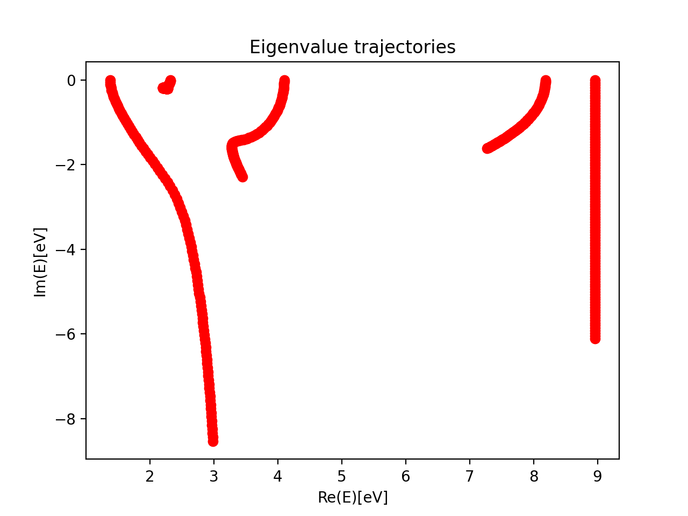

.. _tutorial:

Tutorial
========

This is a tutorial to get you started using PyOpenCAP. Here, we walk through the steps to generate
the zeroth order Hamiltonian and the CAP matrix required to perform
perturbative CAP/XMS-CASPT2 calculation on the :math:`{}^2\Pi_g` shape resonance of 
:math:`N_2^-`. 

To follow along with the tutorial, clone the repository, and open a Python3 interpreter in
the `examples/pyopencap/openmolcas`_ 
directory. Alternatively, copy the files "nosymm.rassi.h5" and "nosymm.out"
located in the `examples/opencap`_ directory to your working directory, and set the "RASSI_FILE"
and "OUTPUT_FILE" variables to the appropriate paths.

A notebook version of this tutorial can be found here_.

.. _here: https://github.com/gayverjr/opencap/blob/master/examples/pyopencap/openmolcas/Tutorial.ipynb
.. _`examples/opencap`: https://github.com/gayverjr/opencap/tree/master/examples/opencap
.. _`examples/pyopencap/openmolcas`: https://github.com/gayverjr/opencap/tree/master/examples/pyopencap/openmolcas

**Preliminary: Importing the module**

In addition to PyOpenCAP, we'll also import numpy to help us process the data. We'll also 
set the paths to the RASSI_FILE and OUTPUT_FILE generated by OpenMolcas, which we'll be processing 
to run our perturbative CAP calculations.

    >>> import pyopencap
    >>> import numpy
    >>> RASSI_FILE = "../../opencap/nosymm.rassi.h5"
    >>> OUTPUT_FILE = "../../opencap/nosymm.out"
    
**Constructing the System object** 

The :class:`~pyopencap.System` object of PyOpenCAP contains the geometry and basis set information, as well
as the overlap matrix. The constructor takes in a Python dictionary as an argument, 
and understands a specific set of keywords_ . There are three equivalent ways of specifying
the geometry and basis set: rassi_h5, molden, and inline. Here, we'll use the rassi_h5 file.

    >>> sys_dict = {"molecule": "molcas_rassi","basis_file": RASSI_FILE}
    >>> s = pyopencap.System(sys_dict)
    >>> smat = s.get_overlap_mat()
    >>> np.shape(smat)
    Number of basis functions:119
    (119, 119)
    
.. _keywords: https://gayverjropencap.readthedocs.io/en/latest/keywords.html

**Constructing the CAP object**

The CAP matrix is computed by the :class:`~pyopencap.CAP` object. The constructor 
requires a :class:`~pyopencap.System` object, a dictionary containing the CAP parameters, 
the number of states (10 in this case), and finally the string "openmolcas", which
denotes the ordering of the atomic orbital basis set. 

    >>> cap_dict = {"cap_type": "box",
            "cap_x":"2.76",
            "cap_y":"2.76",
            "cap_z":"4.88",
            "Radial_precision": "14",
            "angular_points": "110"}
    >>> pc = pyopencap.CAP(s,cap_dict,10,"openmolcas")
    
**Parsing electronic structure data from file**

The :func:`~pyopencap.CAP.read_data` function can read in the effective Hamiltonian
and densities in one-shot when passed a Python dictionary with the right keywords_. For now,
we'll retrieve the effective Hamiltonian and store it as h0 for later use.

    >>> es_dict = {"method" : "ms-caspt2",
           "molcas_output":OUTPUT_FILE,
           "rassi_h5":     RASSI_FILE}
    >>> pc.read_data(es_dict)
    >>> h0 = pc.get_H()

**Passing densities in RAM**

Alternatively, one can load in the densities one at a time using the :func:`~pyopencap.CAP.add_tdms` 
or :func:`~pyopencap.CAP.add_tdm` functions. We load in the matrices from rassi.h5 
using the h5py package, and then pass them as numpy arrays to the :class:`~pyopencap.CAP` object. 
In this example, the CAP matrix is made to be symmetric.

    >>> import h5py
    >>> f = h5py.File('anion_ms.rassi.h5', 'r')
    >>> dms = f["SFS_TRANSITION_DENSITIES"]
    >>> pc = pyopencap.CAP(s,cap_dict,10,"openmolcas")
    >>> for i in range(0,10):
    >>>     for j in range(i,10):
    >>>         dm1 = np.reshape(dms[i][j],(119,119))
    >>>         pc.add_tdm(dm1,i,j,"openmolcas",RASSI_FILE)
    >>>     if i!=j:
    >>>         pc.add_tdms(dm1,j,i,"openmolcas",RASSI_FILE)
    

Once all of the densities are loaded, the CAP matrix is computed 
using the :func:`~pyopencap.CAP.compute_perturb_cap` function. The matrix can be retrieved using the
:func:`~pyopencap.CAP.get_perturb_cap` function.

    >>> pc.compute_perturb_cap()
    >>> W_mat=pc.get_perturb_cap()

We now have our zeroth order Hamiltonian (stored in h0) and our CAP matrix(W_mat) in
the state basis. Extracting resonance position and width requires analysis of the 
eigenvalue trajectories. 

The script `example.py`_ runs this example and diagonalizes the CAP-augmented Hamiltonian :math:`H^{CAP}=H_0-i\eta W`
over a range of :math:`\eta`-values. The reference energy was obtained in a separate calculation which 
computed the ground state of the neutral molecule with CASCI/CASPT2 using the optimized orbitals of the 
anionic state. The results are plotted below:

The resonance trajectory will vary slowest with the changing CAP strength. Zooming in on the 
trajectory near 2.2eV, we also plot the "corrected" trajectory, which is obtained by applying the
first-order correction: 

:math:`U(\eta)=E(\eta)-\eta\frac{\partial E(\eta) }{\partial \eta}`.

.. image:: images/res_trajectory.png

Finally, the best estimate of resonance position and width are obtained at the stationary point 

:math:`\eta_{opt} = min \left | \eta^2 \frac{\partial^2 E }{\partial \eta^2} \right |`. 

For this example, this yields a resonance energy of 2.15eV, and a width of 0.35eV.

.. _`example.py`: https://github.com/gayverjr/opencap/blob/master/examples/pyopencap/openmolcas/example.py 

